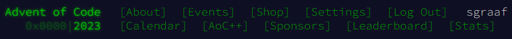

# 🎄 Advent of Code 2023 🌟

This repository contains my solutions for [Advent of Code 2023](https://adventofcode.com/2023/) in Python 🐍 using only the standard library. My solutions might not have the lowest possible computational complexity, but they should all feature good, clean (and largely functional) Pythonic code.

The solution to each day's puzzle (along with any input) is stored in its own directory:

-   [Day 1: Trebuchet?!](./day01)
